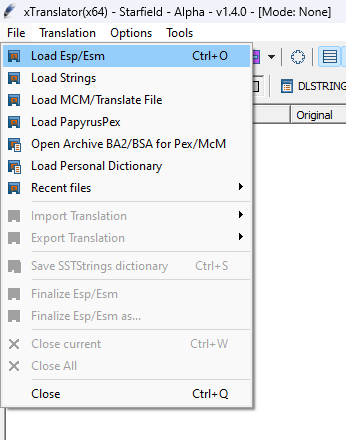
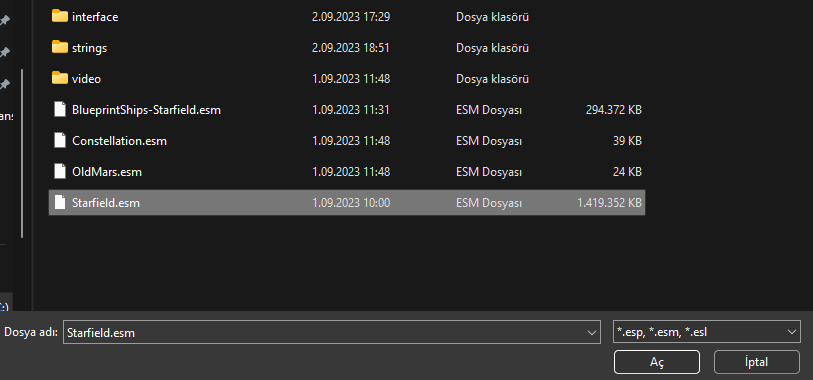
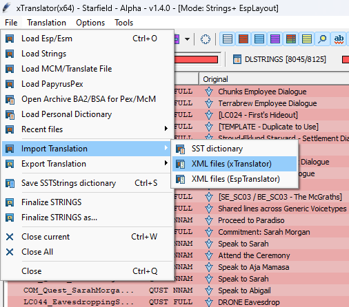
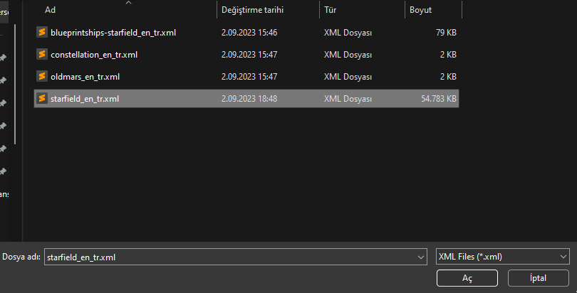
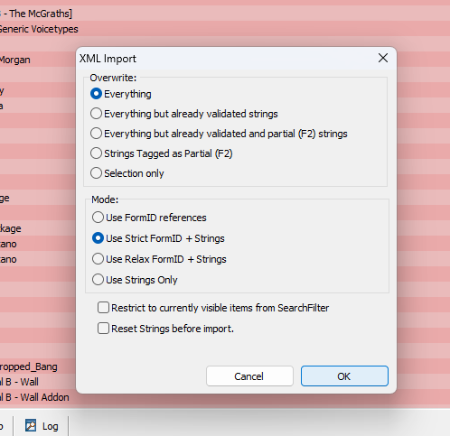
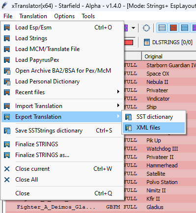
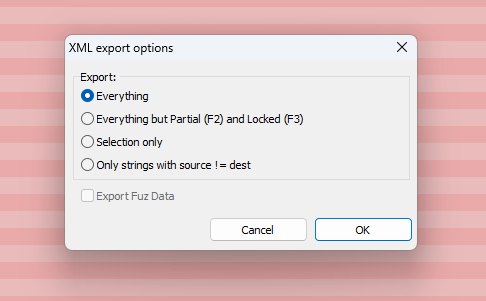

# Starfield Türkçe Çeviri

Starfield Oyunu için oluşturulmuş makine çevirisini içerir. Bu projenin amacı makine çevirisi ile oluşturulmuş çeviriyi topluluğun desteğiyle geliştirmektir.

Çevirinin NexusMods linkine [buradan](https://www.nexusmods.com/starfield/mods/304) ulaşabilirsiniz.

Çeviri [XTranslator](https://www.nexusmods.com/starfield/mods/313) uygulaması ile yapılmaktadır.

---

### Dosya içeriği

"Çeviriler" klasöründeki dosyalarda her bir metin, ingilizce ve türkçe makine çevirisi formları beraber olacak şekilde yer almaktadır.

---

### İşleyiş

Bu dosyalarda düzeltmek istediğiniz kısımlar için işleyiş şu şekilde olmalıdır:

1. İlk olarak issues kısmında düzeltmeyi planladığınız aralık için bir issue'nun olup olmadığını kontrol ediniz.
2. Eğer yoksa başlığı ilgili dosya adı (Starfield - Constellation - Old Mars - BlueprintShips) + bu dosyadaki düzeltmek istediğiniz kısım (strings - dlstrings - ilstrings) + elden geçirmek istediğiniz satır aralığı (örn. "Starfield - dlstrings - [0- 100]"), açıklamasında da tahmini olarak ne kadar sürede bitirebileceğiniz olacak şekilde bir issue oluşturun.
3. Repo'yu forklayıp kendi fork'unuz üzerinde değişiklikleri yapın
4. Bu fork için bir pull request oluşturun

Şimdilik insanların aynı işleri tekrar tekrar yapmasını önlemek için bu şekilde bir işleyiş planlanıyor. Duruma göre gelecek geri bildirimler ile bu işleyiş güncellenebilir.

Gönderilen pull requestleri şimdilik ben gözden geçireceğim, zamanla projeye destek sağlamış kişilerinde review'leri dikkate alınıp asıl proje ile birleştirilecektir.

---

### XTranslator Nasıl Kullanılır

#### Çeviri Nasıl Yüklenir

1. Çevirisini yapmak istediğiniz .esm dosyasını yüklemek gerekiyor

   
   
2. Çevirinin kendisini yüklemek gerekiyor
   
   
   
3. Yapacağımız değişiklikleri yapıyoruz (Bknz. Çeviri ile ilgili notlar)
4. Çeviri dışa aktarılır
   
   

---

#### Çeviri ile ilgili notlar

Bir çeviriye sağ tıkladığınız zaman aşağıdaki görseldeki gibi bir menü ortaya çıkmaktadır. Makine çevirisinin doğru olduğu metinlerde doğrudan "Validate As [Translated]" seçeneğini seçiniz. Sarı metinler, çeviriye gerek duymayan metinler bunlar yakında işaretlenecek. Çevirileri düzelttikten sonra da aynı şekilde "Validate As [Translated]" seçeneğini seçiniz.

   
